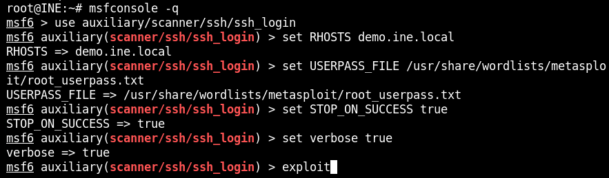

# Bruteforce and Password cracking Live
In this lab environment, the user is going to get access to a Kali GUI instance. An SSH server can be accessed using the tools installed on Kali on http://demo.ine.local

Objective: Perform the following activities:

1. Find the password of user "student" using Hydra. Use password dictionary: /usr/share/wordlists/rockyou.txt.gz

2. Find the password of user "administrator" use appropriate Nmap script. Use password dictionary: /usr/share/nmap/nselib/data/passwords.lst

3. Find the password of user "root" using the ssh_login Metasploit module. Use userpass dictionary: /usr/share/wordlists/metasploit/root_userpass.txt

## Task 1
Find the password of user "student" using Hydra. Use password dictionary: /usr/share/wordlists/rockyou.txt.gz

### 1. Determing what service is running
Start to nmap the machine for open port and determing the service.
```bash
nmap -sV -sS demo.ine.local
```

After running the nmap command we discovered ssh is running on port 22 with OpenSSH 7.2p2

### 2. Find password for user student with hydra
Running command: $hydra -l student -P /usr/share/wordlists/rockyou.txt demo.ine.local ssh to attack the ssh service.

The password for the student was friend.

## Task 2
Find the password of user "administrator" use appropriate Nmap script. Use password dictionary: /usr/share/nmap/nselib/data/passwords.lst

### Retrieving password with nmap script
nmap has a script named ssh-brute that can be used for dictionary attacl on the SSH service. The script need two input, one list for username and one for password. In this task we need to make a list with the user administrator and use the list "password.lst".
cmd:
```yml
nmap -p 22 --script ssh-brute --script-args userdb=/root/users demo.ine.local
```
output:

The password was sunshine.

## Task 3
Find the password of user "root" using the ssh_login Metasploit module. Use userpass dictionary: /usr/share/wordlists/metasploit/root_userpass.txt

### Use metasploit to retrieve password for root
Setup the metasploit with variables in metasploit.
