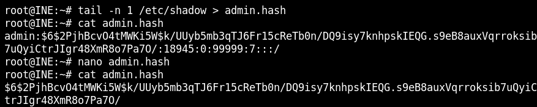
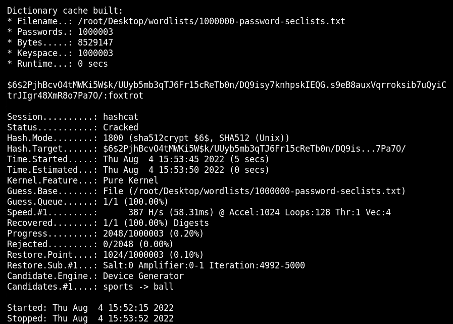
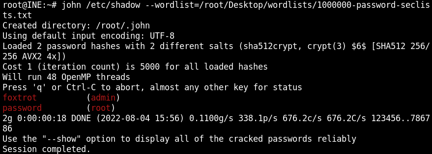

# Bruteforce and Password cracking Offline
In this lab environment, the user will get access to a Kali GUI instance. John the Ripper (JTR) and Hashcat tools are present on this machine.

**Objective: Perform the following activities:**

1. Crack the hashes of user "admin" using John The Ripper/Hashcat and recover the password. 
2. Find the password for the protected Microsoft Office .docx file using John The Ripper/Hashcat.

## Task 1
Crack the hashes of user "admin" using John The Ripper/Hashcat and recover the password. 

### Find the hashes
First run this commands for finding hashes and encrypted method:
1. cat /etc/shadow
2. cat /etc/login.defs
3. grep -A 18 ENCRYPT_METHOD /etc/login.defs
4. Copy the admin hash over to a new file: tail -n 1 /etc/shadow > admin.hash
5. delete all other information from the hash files and only left the hashes again

### Hashcat
Using the command: $ hashcat -m 1800 -a 0 admin.hash /root/Desktop/wordlists/1000000-password-seclists.txt

The password is foxtrot.

### JohnTHeRIIIIIIpper
With JTR we can run the shadowfile without taking out the hash with this command: $john /etc/shadow --wordlist=/root/Desktop/wordlists/1000000-password-seclists.txt
