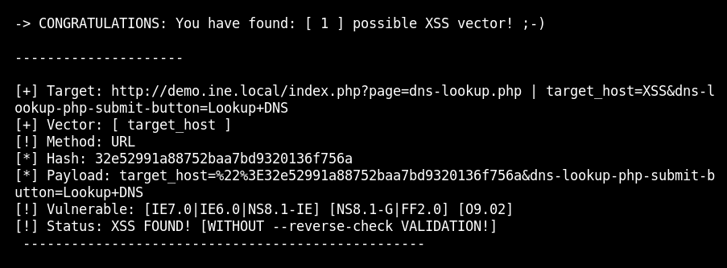

# Cross site scripting
In this lab environment, the user is going to get access to a Kali GUI instance. An instance of the Mutillidae web application can be accessed using the tools installed on Kali at http://demo.ine.local

Objective: Perform an XSS Attack on the web application with XSSer!

# 1. Use nmap to find the service
Use: $nmap demo.ine.local to find running service

# 2. Browse to the open service
The port 80 is open, the port 80 is a http service.

# 3. Go to DNS Lookup
Choose in the left navbar: OWASP 2017 -> A7- Cross site scripting (XSS) -> Reflected (First order) -> DNS lookup

# 4. Setup Burpsuite with localhost
After setup with intercept, enter "HelloWorld" in the Hostname/IP and click Lookup DNS.

# 5. Intercept
After submiting, the burpsuite will intercept and make a path to target host.

# 6. Insert the target host to XSS
Use this command to run XSS with xsser: $xsser --url 'http://demo.ine.local/index.php?page=dns-lookup.php' -p 'target_host=XSS&dns-lookup-php-submit-button=Lookup+DNS' and the result was:

The output confirms that the target is vulnerable.

# 7. Xsser with auto tag
Use this command to run XSS auto with xsser: $xsser --url 'http://demo.ine.local/index.php?page=dns-lookup.php' -p 'target_host=XSS&dns-lookup-php-submit-button=Lookup+DNS' --auto and the result was:

The output confirms that the target is vulnerable to 99% injection.

# 8. xsser with custome tag
Command: $xsser --url 'http://demo.ine.local/index.php?page=dns-lookup.php' -p 'target_host=XSS&dns-lookup-php-submit-button=Lookup+DNS' --Fp ""
The cmd will force a final attack that can be used in burp to change out the target_host.

Change out the target host in burp then forward:

the final result in browser is:
