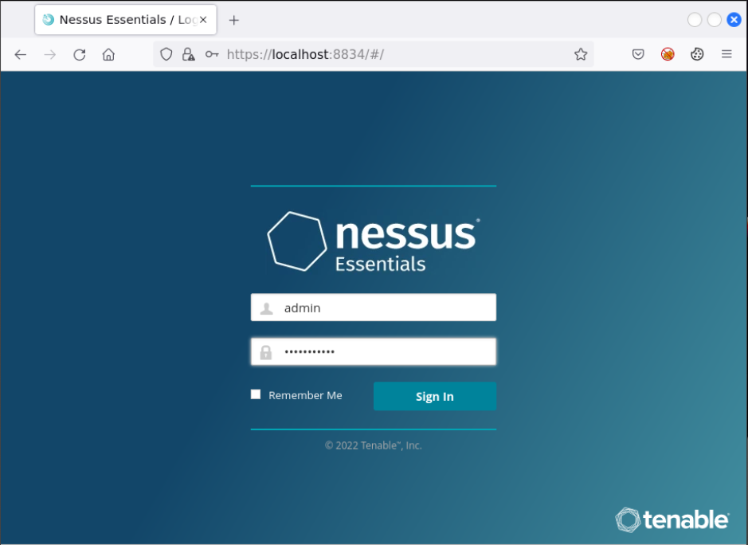
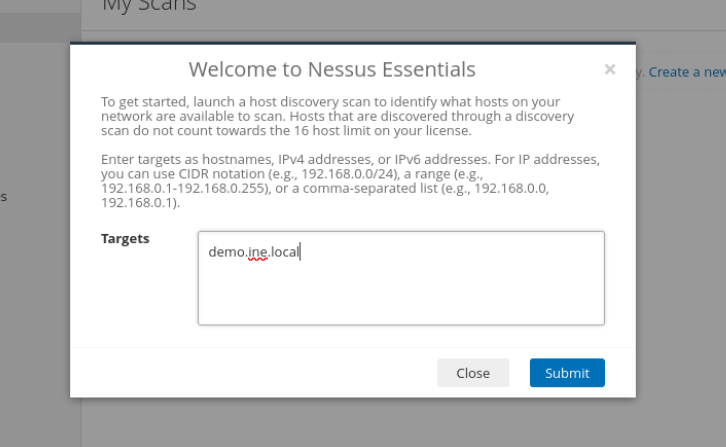
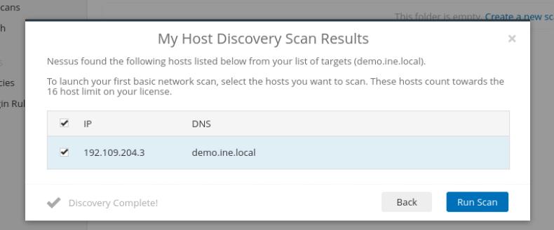
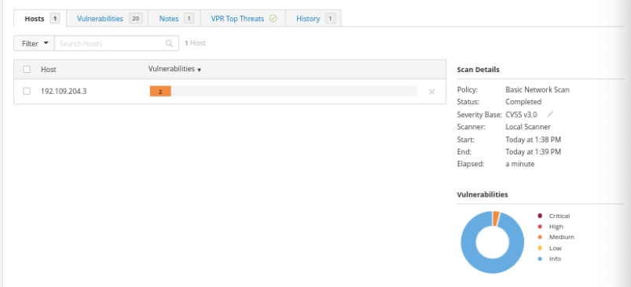
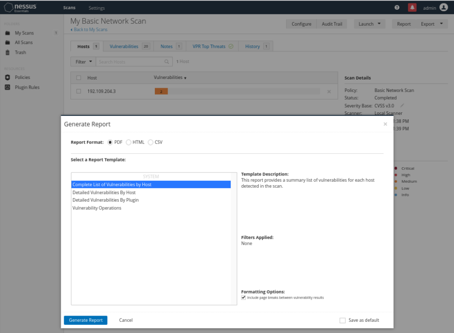
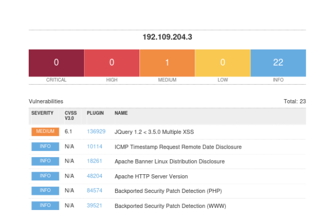
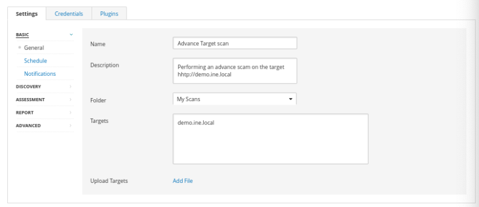
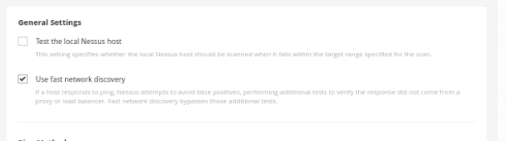

# Nessus
In this lab environment, the user is going to get access to a Kali GUI instance. An instance of the Mutillidae web application can be accessed using the tools installed on Kali at http://demo.ine.local.

Objective: Perform vulnerability scan on the target machine using Nessus.

Relevant information
- Username: admin
- Password: Adminpasswd

# 1. Browse til Nessus dashboard
Use the link: https://localhost:8834 og logging with the information from relevant information.

# 2. Scan the target machine
Enter target machine and submit

After submiting, follow screen should show up, then select the ip and run scan:

When the scan its finish, you will get this screen:

The scan discovered 2 medium severity vulnerabilities. If you want to see more information about the vulnerabilities you can click on it to see more details.

# 3. Download the report
Up in the right corner click on Report and Complete List of Vulnerabilities by Host, then generate Report.

After download, you will get this report:

# 4. Test out custome scan
Start a custome scan with clicking on new scan in top right corner, then choose advance scan. Fill out the information that is neccesary.
Under basic:

Discovery - Host:

Discovery - Port:
- Check TCP
Assessment - General:
- Check Perform through tests
Assessment - Web applications:
- Turn on scan web applications

# 5. Start the scan
After you have made a new scan, the scan will show under My scans, to start the scan, click on the play button.

# 6. Check the scan
The scan can be downloaded as the normal scan, but its recommended to download as HTMl page to easier debug and understand.
