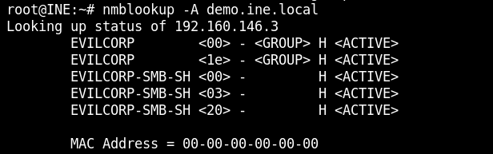
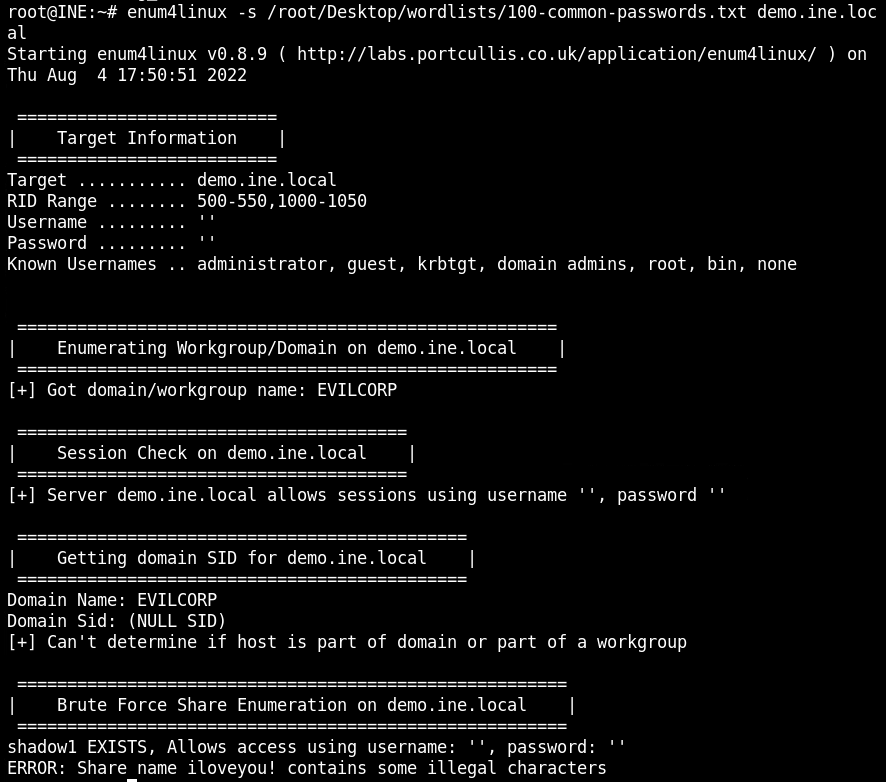

# Null session
In this lab environment, the user is going to get access to a Kali GUI instance. SMB service is running on the target machine available at demo.ine.local.

Objective: Scan the target machine and find the 3 flags:

Flag 1 is present in the file named flag_1 in a publicly accessible share.
Flag 2 is present in a directory named flag_2 in a non-browsable share of one of the users.
Flag 3 is present in a file named flag_3 in yet another non-browsable share.

## Flag 1
Flag 1 is present in the file named flag_1 in a publicly accessible share.

### location the service
Nmap the service with: $ nmap -sS -sV  demo.ine.local.

smbd is running at port 139 and 445 with TCP.

Running UDP to determine status of nmbd service: $nmap -sU --top-ports 25 demo.ine.local

This confirm that nmbd is running on port 137 and 138. The port 137 is running on target machine

### smbclient to list available shares on target samba server
Running the smbclient: $smbclient -L demo.ine.local -N

### nmblookup
Running nmblookup for checking if the file sharing service is availbale on the target machine: % nmblookup -A demo.ine.local

THe output from EVILCORP smb share indicates that the node is running an SMB file server. Since the SMB file server is enabled and active we can access files on the available shares. But before we do that we need to check the permissions on the shares.

### Checking the permissions with enum4linux
Used the enum4linux for checking permissions: $ enum4linux -d -S demo.ine.local

The SMB server is accepting empty password and username.

### Connecting to SMB
Connect to the server with smbclient: $smbclient //demo.ine.local/public -N

### Retrieve flag 1

## Flag 2
Flag 2 is present in a directory named flag_2 in a non-browsable share of one of the users.

### Print out user at the server
used: $enum4linux -U demo.ine.local

The server got 6 users.

### Check permissions
used: smbmap -H demo.ine.local

Only 4 users was listed, that means the two last user was not discovered or maybe have permissions.

### Check out the two last users
Tried to connect with the two users, got in with michael.

### Retrieve the flag
The flag was in the map dir/flag_2/flag_2

## Flag 3
Flag 3 is present in a file named flag_3 in yet another non-browsable share.

### Bruteforce the share names
used: enum4linux -s ~/Desktop/wordlists/100-common-passwords.txt demo.ine.local

Found a share named shadow1.

### Connect to shadow1 to retrieve flag3
Connect with smbclient for retrieving flag3
