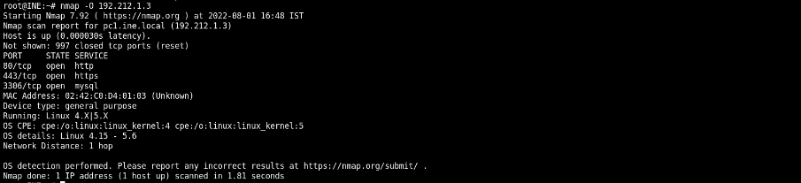

# Scanning and OS Fingerprinting
In this lab environment, the user is going to get access to a Kali GUI instance. There are a few machines on the same network running various services.


**Objective:** Perform scanning and OS fingerprinting using the Nmap tool and answer the following questions:

1. How many machines are there?
2. What ports are open on pc1.ine.local machine?
3. What OS is running on machine pc1.ine.local machine?
4. What services are running on pc2.ine.local machine?
5. What is the version of the FTP server running on one of the machines?
6. A caching server is also running on one of the machines. What is the domain name of that machine?
7. A NoSQL database and SQL database services are running on different machines. Can we use Nmap scripts to extract some information from those?

# Task 1: How many machines are there?
First find the IP and the mask of the machine, then scan with nmap for host discovery.

The machine have 6 active host.

# Task 2: What ports are open on pc1.ine.local machine?
Run a normal nmap scan for all the IP and open ports with: $nmap 192.212.1.0/24.

IP for pc1.ine.local is 192.212.1.3 and have 3 open ports: 80, 443 and 3306

# Task 3: What OS is running on machine pc1.ine.local machine?
Run nmap with OS tag: $nmap -O 192.212.1.3

The machine pc1 is running Linux 4.X|5.X

# Task 4: What services are running on pc2.ine.local machine?
Use nmap to scan all the ports on the machine with the -p- or -p1-65535 tag.

Then running service on pc2 is mongodb at port 27017.

# Task 5: What is the version of the FTP server running on one of the machines?
Use nmap to scan all open service on port 21 with: $nmap -p21- -sV 192.212.1.0/24.

FTP server is running on machine 4 with version vsftpd 3.0.3.

# Task 6: A caching server is also running on one of the machines. What is the domain name of that machine?
Use the same nmap scan as last task: $nmap -p21- -sV 192.212.1.0/24.

pc3.ine.local is running the memcache with version Memcached 1.5.12.

# Task 7: A NoSQL database and SQL database services are running on different machines. Can we use Nmap scripts to extract some information from those?
Use the same nmap scan as last task: $nmap -p21- -sV 192.212.1.0/24.

Is two running service at the machine, pc1 and pc2. The pc1 is running MySql and pc2 is running mongoDB.

**Check mongoDB**
Find information about mongoDB:
```bash
$nmap -p27017 --script=mongodb-info 192.212.1.4
```

With the command the pentester can grep and find the db version.

Find the databases:
```bash
$nmap -p27017 --script=mongodb-databases 192.212.1.4
```

The command will dump the the list of all databases from mongoDB.

Bruteforce the databases:
```bash
$nmap -p27017 --script=mongodb-brute 192.212.1.4
```

The databases dont require authentication.

**Check mySQL**
```bash
$nmap -p3306 --script=mysql-* 192.212.1.3
```

To dump all information from all the script